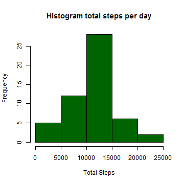
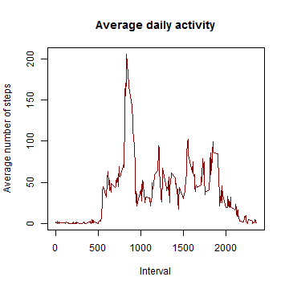
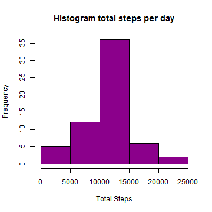
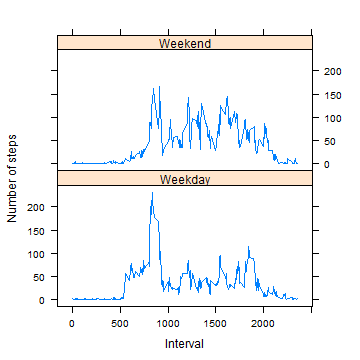

---------------------------------
# Reproducible Research: Peer Assessment 1


## Loading and preprocessing the data

```r
# load data file
mydata <- read.csv("activity.csv")
# process data to convert date column to date class
mydata$date <- as.Date(mydata$date)
```


## What is mean total number of steps taken per day?
***Make a histogram of the total number of steps taken each day***


```r
# make a new dataframe without NA values
cleanData <- mydata[!is.na(mydata$steps), ]
# load plyr library
library(plyr)
# group values by date
groupedByDate <- ddply(cleanData, ~date, summarise, sum = sum(steps))
```


```r
# construct the histogram
hist(groupedByDate$sum, xlab = "Total Steps", main = "Histogram total steps per day", 
    col = "darkgreen")
```

 

***Calculate and report the mean and median total number of steps taken per day***

```r
# Calculate mean value
mean(groupedByDate$sum)
```

```
## [1] 10766
```

```r

# Calculate median value
median(groupedByDate$sum)
```

```
## [1] 10765
```


## What is the average daily activity pattern?

***Make a time series plot (i.e. type = "l") of the 5-minute interval (x-axis) and the average number of steps taken, averaged across all days (y-axis)***

```r
groupedByInterval <- ddply(cleanData, ~interval, summarise, mean = mean(steps))
with(groupedByInterval, plot(interval, mean, type = "l", ylab = "Average number of steps", 
    xlab = "Interval", main = "Average daily activity", col = "darkred"))
```

 


***Which 5-minute interval, on average across all the days in the dataset, contains the maximum number of steps?***

```r
# first find max value
maxVal <- max(groupedByInterval$mean)
print(maxVal)
```

```
## [1] 206.2
```

```r
# locate the line containing this value
maxLine <- groupedByInterval[groupedByInterval$mean == maxVal, ]
# find the interval
maxInterval <- maxLine$interval
print(maxInterval)
```

```
## [1] 835
```

**The maximum number of steps (on average across all the days) is maxVal: 206.1698  
and it is contained in interval maxInterval:835**

## Imputing missing values
  
***Calculate and report the total number of missing values in the dataset (i.e. the total number of rows with NAs)***

```r
# calculate sum of missing values
sum(is.na(mydata$steps))
```

```
## [1] 2304
```


***Devise a strategy for filling in all of the missing values in the dataset.***  
**- My strategy will be to use the mean for that 5-minute interval**

***Create a new dataset that is equal to the original dataset but with the missing data filled in.***

```r
# create a new dataset
newdata <- mydata
# locate tha NAs
missingsteps <- is.na(newdata$steps)
# convert interval(s) to factor(s)
newdata$interval <- factor(newdata$interval)
groupedByInterval$interval <- factor(groupedByInterval$interval)

# fill newdata on missing values wherever we have a missing value, fill it
# from groupedByInterval$mean column (steps) where newdata$interval ==
# groupedByInterval$interval (intervals are factors)
newdata[missingsteps, "steps"] <- groupedByInterval[newdata[missingsteps, "interval"], 
    "mean"]
```


***Make a histogram of the total number of steps taken each day and Calculate and report the mean and median total number of steps taken per day. Do these values differ from the estimates from the first part of the assignment? What is the impact of imputing missing data on the estimates of the total daily number of steps?***


```r
# group values by date
groupedByDate2 <- ddply(newdata, ~date, summarise, sum = sum(steps))

# construct the histogram
hist(groupedByDate2$sum, xlab = "Total Steps", main = "Histogram total steps per day", 
    col = "darkmagenta")
```

 

```r

# Calculate mean value
mean(groupedByDate2$sum)
```

```
## [1] 10766
```

```r

# Calculate median value
median(groupedByDate2$sum)
```

```
## [1] 10766
```


**We notice that mean stays the same and median increases by one**  
**However as we see from the histogram the impact is very 'light'**


## Are there differences in activity patterns between weekdays and weekends?

***Create a new factor variable in the dataset with two levels - "weekday" and "weekend" indicating whether a given date is a weekday or weekend day.***  


```r
# add a new column containing day of week
newdata$weekday = weekdays(newdata$date)
# add a new column containing either Weekday OR Weekend
newdata$weekday.type <- ifelse(newdata$weekday == "Saturday" | newdata$weekday == 
    "Sunday", "Weekend", "Weekday")
# convert column to factor
newdata$weekday.type <- factor(newdata$weekday.type)
```


***Make a panel plot containing a time series plot (i.e. type = "l") of the 5-minute interval (x-axis) and the average number of steps taken, averaged across all weekday days or weekend days (y-axis).***


```r
# make a new dataset grouping data by interval and weekday.type
groupedBy.Interval.WeekDay <- ddply(newdata, ~interval + weekday.type, summarise, 
    mean = mean(steps))

# For a nice plot 'unfactor' interval. Be careful to convert to characters
# first, or else you get the level values 1,2,3...
groupedBy.Interval.WeekDay$interval <- as.numeric(as.character(groupedBy.Interval.WeekDay$interval))
library(lattice)
xyplot(mean ~ interval | weekday.type, groupedBy.Interval.WeekDay, type = "l", 
    layout = c(1, 2), xlab = "Interval", ylab = "Number of steps")
```

 

